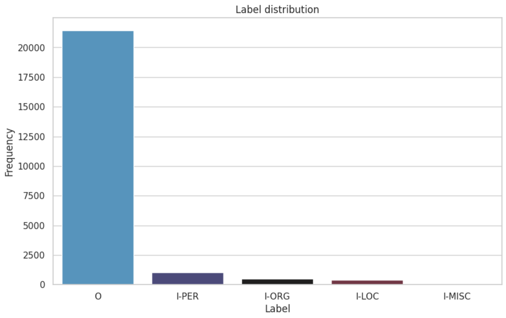
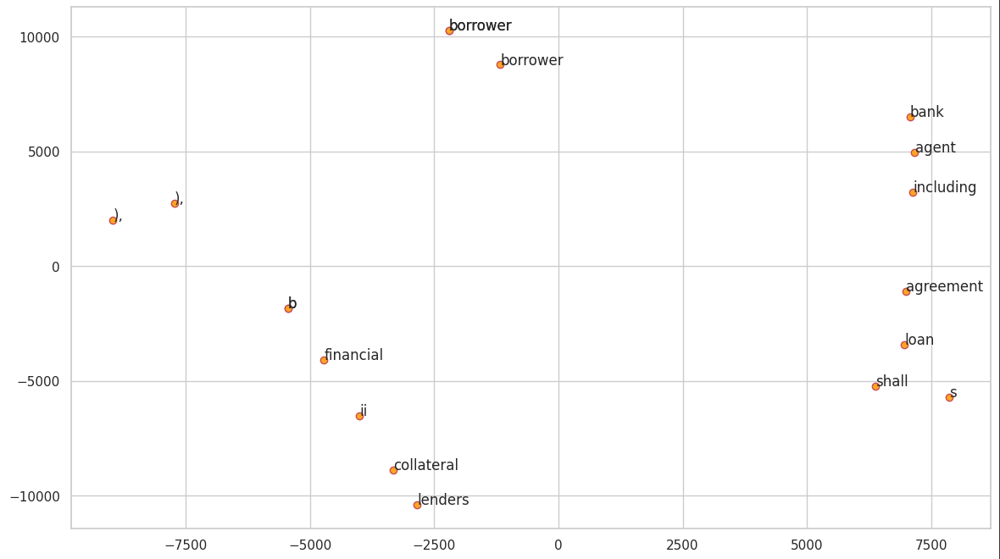

# Extracting Financial Entities: A Comparative Evaluation for Domain-Specific NER

##  📖 About

This project implement Named Entity Recognition (NER) for financial documents and emails, focusing on deep learning architectures such as LSTM, GRU, BiLSTM, and Transformer-based models (BERT). The workflow covers everything from data preprocessing to model training, evaluation, and comparison in a financial text domain.

## Authors

- *Andrea Sciortino*
- *Vittoria Cassola*
- *Alessio Benzonelli*
- *Alberto Venturini*
  
## Dataset
The dataset comprises financial documents from the U.S. Security and Exchange Commission, with over 20,000 words annotated for NER tasks. 

# Project Structure
The goal is to identify financial entities (organizations, locations, people) in text accurately using modern neural network approaches. Key steps include:

1. **Exploratory Data Analysis (EDA)**

  

2. **Data preprocessing and sentence structuring**

3. **Tokenization and embedding**: done using GloVe.

  

4. **Model training**: The project systematically evaluates four distinct neural architectures:
     - Baseline Multinomial Naive Bayes
     - LSTM Networks: Capturing sequential dependencies in financial text
     - Bidirectional LSTM: Processing sequences in both forward and backward directions
     - Transformer-based BERT: State-of-the-art contextual understanding

5. **Evaluation**: comparison using macro F1, recall, precision, and accuracy metrics.

# 💡 Results

Bidirectional LSTM (BiLSTM) and GRU architectures demonstrate effectiveness in financial Named Entity Recognition tasks, while LSTM and BERT-based models also show robust and competitive performance in modeling complex contextual information. However, it should be noted that these results may be influenced by class imbalance within the dataset, which can impact the accuracy and generalizability of the models.

Bidirectional LSTM (BiLSTM) and GRU architectures demonstrate superior effectiveness in financial Named Entity Recognition tasks, while LSTM and BERT-based models also exhibit robust and competitive performance. However, it should be noted that these results may be influenced by class imbalance within the dataset, which can impact the accuracy and generalizability of the models.
